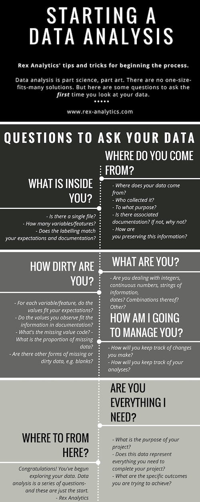

```{r setup, include=FALSE}
library(tidyverse)
# the following sets global options
knitr::opts_chunk$set(echo = TRUE, fig.align = "center", message = FALSE, warning = FALSE)
```
```{r, echo=FALSE}
htmltools::img(src = knitr::image_uri("RLadiesQro logo.png"), 
               alt = 'logo', 
               style = 'position:absolute; top:0; right:0; padding:10px;')
```

***

# The benefits of learning R and the tidyverse  
This is my friend Colin, who started learning R about the same time I did, but to analyze baseball data.  In 2013 he was hired by the worst team in major league baseball as a data analyst.  Here he is four years later, posing with the World Series trophy and showing the ring given to him by the team:    

<center>
  

 
</center>

The data are clear (n = 1): learning R and the tidyverse will make you rich and famous*.

*Colin is neither rich nor famous.  He is, however, very employable.

***
### Why are data scientists in demand?  Because data can be difficult to analyze  

Why don't we just use Excel for everything?  This is one reason:  

<center>

</center>

From **Steph de Silva**, Rex Analytics:  
[A guide for understanding your data](rex-analytics.com/data-analysis-questions-to-ask-the-first-time/)

<center>

</center>
***

From **Sharla Gelfand**, co-organizer of R-Ladies-Toronto:  
[An example of using the tidyverse on real-world data](https://uoft-brown-bag-data-cleaning.netlify.com/#1)

Slide 3:  

"Some questions to ask yourself...  
- What do I want my data to look like when I go to use it?  
- What does it look like now?  
- How do I get there?  
- How can I be as lazy as possible?"  

***
# The tidyverse  
### The principles of tidy data

- The tidyverse works primarily with data frames
- In tidy data, each column is a variable and each row is an observation
- Tidy data tends to be long (many observations) instead of wide

### The benefits of the tidyverse

- tidyverse functions integrate well with each other and use consistent and clear syntax
- tidyverse functions can be chained using the pipe: `%>%`
- tidyverse output can be piped directly into ggplot2

### How are tidyverse functions organized?

- Most tidyverse functions have the format `function(data, options)`
- Pipes allow the format `data %>% function1(option) %>% function2(option) %>%` ...
- By using pipes, the data can go through several operations without creating intermediate objects

## The tidyverse package suite
* readr - to read in two-dimensional data  
* tidyr - for data organization  
* dplyr - for data manipulation  
* tibble - a modified approach to dataframes  
* stringr - to work with character strings  
* ggplot2 - for graphics  
* several other packages that integrate well with the above

We will work with dplyr commands to manipulate data and ggplot2 to visualize it.  We can load each package separately, but loading the tidyverse is easier.
```{r eval=FALSE, message=FALSE}
# use install.packages("tidyverse") if you have not loaded the tidyverse before
library(tidyverse)
```

## dplyr functions
* `%>%` - the pipe operator, similar to `|` in Linux
* `select` - choose columns  
* `filter` - choose rows based on conditions  
* `arrange` - sort rows based on column values  
* `mutate` - convert data in an existing column into new data in a new column  
* `summarize` - provide summary data for a column  
* `group_by` - group data based on a variable; often used with summarize

***
# Two examples of non-tidy data  

#### Example 1

On `#rstats` Twitter, users can post their questions.  One that I encountered asked how to work with the following dataframe in which a series of questions (Q) were evaluated by individual raters:  

```{r echo=TRUE}
data <- data.frame("id" = c("Q1", "Q2", "Q3", "age", "gender", "language"),
                   "rater1" = c(7, 6, 9, 21, 1, 1),
                   "rater2" = c(8, 9, 10, 32, 2, 2),
                   "rater3" = c(10, 6, 8, 38, 2, 1))
data
```

What is wrong with how these data are arranged?  

Answers:  
- "age", "gender", "language" are variables and should be in columns  
- "gender" and "language" are coded as numeric data, but are really factors disguised as numbers  
- the data will be easier to analyze if they are transposed so that rows become columns and vice versa  

```{r echo=TRUE, warning=FALSE}
new_data <- data %>%                                     # first identify the data
   select(-id) %>%                                       # select all columns except "id"
   t() %>%                                               # transpose (creates a matrix)
   as_tibble(rownames = "rater")                         # change to tibble and convert rownames
colnames(new_data) <- c("rater", as.character(data$id))  # change column names
new_data                                                 # look at the new dataframe
```

The data can now be further tidied so that "question" becomes a variable:  

```{r echo=TRUE}
tidy_data <- new_data %>%
   gather(Q1:Q3, key = "question", value = "rating") %>%    # gather 3 columns into 2
   select(rater, question, rating, age, gender, language)   # reorder the columns
tidy_data
```

Tidy data may appear strange at first, because certain variables (e.g. age) seem to be unnecessarily repeated.  However, this "long data" format allows us to use tidyverse commands to pull out information quickly.  

#### Example 2

To see how a larger, disorganized dataset can be cleaned up using the tidyverse, let's look at another example.  

We can see available datasets loaded with R by typing `data()`.  Most of the datasets that load with base R are reasonably organized, but `tidyverse` comes preloaded with messy datasets that have problems similar to those found in most raw data.  

For example, we can look at the dataframe `billboard` that contains song data from the Billboard Hot 100 chart for the year 2000.  There are several choices to get an initial look at the data that you can run in your console after loading `tidyverse`:

```{r echo=TRUE, eval=FALSE}
library(tidyverse)
str(billboard)          # the base R way to see the structure of a dataframe
summary(billboard)      # view summary statistics and also detect NA values
glimpse(billboard)      # the tidyverse version of str()
```
```{r}
head(billboard)
```
The dataframe contains 317 "observations" of 79 "variables".  However, is "wk1" truly a variable?  No, "week" is a variable, and "1" would be a value for "week" that is part of an observation.  In addition, these data are hard to understand.  There are many NA values, and some columns have nothing but NAs.  

***
### How can we prepare this dataset for downstream analysis?  

First we want to have a clearer idea of what is meant by the numbers in the "wk-" columns.  They look like chart rankings, but is "wk1" the first week of January?  The `gather` function in the `tidyr` package allows us to quickly combine all of the columns that begin with "wk-" into two columns, one for "week" and one for the values in the columns.  Then by looking at a single song we can better understand the data.  We can visualize the output without saving it:  
```{r echo=TRUE}
billboard %>% 
   gather(wk1:wk76, key = "week", value = "rank") %>%                # combine 76 columns into 2
   arrange(track)                                                    # look at a single song
```
Note how "long" this dataframe is now: 24,092 observations of 5 variables!  But it already makes more sense.  

The quick analysis shows us that "week" is not week of the year, but number of weeks on the chart.  The "date.entered" column tells us when the song first appeared on the chart, but we do not yet have a variable that tells us the chart position for a specific week.  Using the guidelines provided in the examples above by Steph de Silva and Sharla Gelfand, let's establish our goals with this dataset:  

1. gather the data as we did above, now using "weeks" as the new variable
2. remove the lines that have NA values for rank
3. convert "wk1", "wk2", etc. to a numeric variable
4. calculate a new variable, "date", that is date.entered + (# of weeks - 1) * 7
5. select and reorder the columns
6. sort the table to have the #1 songs at the top arranged by date  

The tidyverse allows us to do all that using piped functions:  

```{r echo=TRUE}
billboard %>% 
   gather(wk1:wk76, key = "weeks", value = "rank") %>%               # combine 76 columns into 2
   filter(!is.na(rank)) %>%                                          # remove rows with NA
   mutate(weeks = as.numeric(str_extract(weeks, "[:digit:]+"))) %>%  # change "wk1" to 1, etc.
   mutate(date = date.entered + (weeks - 1) * 7) %>%                 # create a new date variable
   select(date, rank, artist, track, weeks) %>%                      # reorder the columns
   arrange(rank, date)                                               # sort by rank and date
```

Note that we have eliminated the `date.entered` variable, but we can easily find out when a song entered the list by using `filter(weeks == 1)` as a piped function.  

***
Although the data are in a cleaner format, we can see some problems.  The #1 songs for the first two weeks of 2000 are missing.  Did we make an error or is the data missing from the dataset?  We will do some further analysis.  But first, now that we are satisfied that the dataset looks tidy, we can edit the pipeline to save the dataframe as an object (NOT by overwriting the original data):

```{r echo=TRUE}
bb_tidy <- billboard %>% 
   gather(wk1:wk76, key = "weeks", value = "rank") %>%               # combine 76 columns into 2
   filter(!is.na(rank)) %>%                                          # remove rows with NA
   mutate(weeks = as.numeric(str_extract(weeks, "[:digit:]+"))) %>%  # change "wk1" to 1, etc.
   mutate(date = date.entered + (weeks - 1) * 7) %>%                 # create a new variable
   select(date, rank, artist, track, weeks) %>%                      # reorder the columns
   arrange(rank, date)                                               # sort by rank and date
```

Now the dataset is much better organized for us to extract information of interest and to visualize.  For example, we can now recreate the Billboard Hot 100 for a particular date:

```{r echo=TRUE, message=FALSE, warning=FALSE}
bb_tidy %>% 
   filter(date == "2000-04-01") %>%
   arrange(rank)
```

This chart is missing the #8 song.  We can check that the tidy dataset is correctly organized using tidyverse functions, but sometimes a graph is more useful.  This graph will show us how many songs are listed for each week---we expect 100 per week.

```{r echo=TRUE}
bb_tidy %>%
   group_by(date) %>%                                          # group the data by date
   tally() %>%                                                 # count the entries for each date
   ggplot(aes(x = date, y = n)) +
   geom_point()                                                # visualize the counts for each date
```

Many entries are missing, particularly before April or after October.  Is there a pattern to the missing data points?  We can view them by limiting the graph to the year 2000 and graphing the ranks for each week.  The `lubridate` package to work with dates and times is part of the tidyverse but does not load with `library(tidyverse)` and must be loaded individually.

```{r echo=TRUE, message=FALSE, warning=FALSE}
library(lubridate)
bb_tidy %>%
   filter(year(date) == 2000) %>%                              # year() is a lubridate function
   ggplot(aes(x = date, y = rank)) +
   geom_point()                                                # visualize the ranks for each date
```

If we were doing a more important analysis with this dataset, we could consult the Billboard Hot 100 charts directly for particular dates (e.g. [15 Jan 2000](https://www.billboard.com/charts/hot-100/2000-01-15)).  It turns out that certain songs, like "Smooth" by Carlos Santana, were left out of the `billboard` dataset for unknown reasons.  We can look up the songs that are missing, verify that they are not in the original `billboard` dataset, and decide whether or not to add them, but that is a challenge for another time.  

***
# Today's challenge: Data on R-Ladies chapters and meetings
## Step 1: Import the data into R

```{r echo=TRUE, message=FALSE, warning=FALSE}
capitulos_rladies <- readr::read_csv("https://raw.githubusercontent.com/cienciadedatos/datos-de-miercoles/master/datos/2019/2019-06-26/capitulos_rladies.csv")
eventos_rladies <- readr::read_csv("https://raw.githubusercontent.com/cienciadedatos/datos-de-miercoles/master/datos/2019/2019-06-26/eventos_rladies.csv")
```

***
## Step 2: Examine the data
```{r echo=TRUE}
glimpse(capitulos_rladies)
glimpse(eventos_rladies)
```

***
## Step 3: Check for possible errors in the datasets
#### Were any of the `eventos_rladies` held by chapters not included in `capitulos_rladies`?
```{r echo=TRUE}
# anti_join shows the observations in the first set that do not have a match in the second set
eventos_rladies %>%
      anti_join(capitulos_rladies, by = "capitulo")
```

An empty table is good news: all of the events were held by known chapters.  

#### Are there any duplicates in the `capitulos_rladies` dataset?

```{r echo=TRUE}
# we can use the distinct() function to tell us if all the capitulos are unique
nrow(capitulos_rladies) == nrow(distinct(capitulos_rladies, capitulo))
```

TRUE means that all of the chapters are unique.  

What are some other possible problems with the data?  

***
## Step 4: Transform your data (but keep the original data!)
```{r echo=TRUE}
# left_join keeps all entries in the first dataset and joins entries in the second dataset
# this means that some chapters are listed multiple times, but filtering is easy
rladies_tidy <- capitulos_rladies %>%
      left_join(eventos_rladies, by = "capitulo")
glimpse(rladies_tidy)
```

#### Which chapters were the first formed?  The most recent?

```{r, echo = TRUE}
# we can use the capitulos_rladies dataset, but our tidy data also works
rladies_tidy %>%
      distinct(capitulo, .keep_all = TRUE) %>%        # .keep_all to keep all variables
      arrange(creacion) %>%
      select(capitulo, pais, creacion, miembros)
rladies_tidy %>%
      distinct(capitulo, .keep_all = TRUE) %>%
      arrange(desc(creacion)) %>%
      select(capitulo, pais, creacion, miembros)
```

#### What are the largest chapters?

```{r echo=TRUE}
rladies_tidy %>%
      distinct(capitulo, .keep_all = TRUE) %>%
      arrange(desc(miembros)) %>%
      select(capitulo, pais, miembros)
```

#### Which chapters have held the most meetings?

```{r echo=TRUE}
# group_by groups based on a variable; summarize performs an operation on the grouped data
rladies_tidy %>%
      group_by(capitulo) %>%
      summarize(cuenta = n()) %>%
      arrange(desc(cuenta))
```


#### Which chapters have held no meetings?

```{r echo=TRUE}
# no meetings (no entries for the chapter in the eventos_rladies data)
capitulos_rladies %>%
      anti_join(eventos_rladies, by = "capitulo") %>%
      select(capitulo, pais, creacion, miembros) %>%
      arrange(creacion)
# the tidy data also has this information represented as NA for titulo_evento
rladies_tidy %>%
      filter(is.na(titulo_evento)) %>%
      select(capitulo, pais, creacion, miembros) %>%
      arrange(creacion)
```

#### What are the chapters in Latin America?

```{r echo=TRUE}
# make a character vector for all Latin American countries
latam <- c("MX", "BZ", "GT", "HN", "SV", "NI", "CR", "PA", "CO", "VE", "EC", "BO", "PE", "CL", "AR", "BR", "UY", "PY", "SR", "GY")
capitulos_rladies %>%
      filter(pais %in% latam) %>%
      select(capitulo, pais, creacion, miembros) %>%
      arrange(desc(miembros))
```

#### What meetings have been attended by Hadley Wickham?  Jenny Bryan?

```{r echo=TRUE}
rladies_tidy %>%
      filter(str_detect(titulo_evento, "Wickham")) %>%   # use stringr function
      select(capitulo, fecha_local, titulo_evento) %>%   # select three columns
      arrange(fecha_local)                               # sort by date
```


## Step 5: Give the tidy data to Elizabeth Valles to visualize with ggplot!
